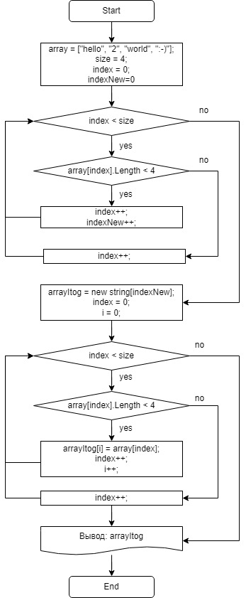

## Описание решения
1. Используя цикл *__for__* проходим по каждому элементу массива и считаем, сколько элементов соответствует условию, для формирования итогового массива из строк и передаем данные в переменную *__indexNew__*.

        for (index = 0; index < size; index++)
        {
            if (array[index].Length < 4) indexNew++;
        }
2. На втором этапе выделяем место для нового массива имея информацию о количестве элементов удовлетворяющих условию, а также обнуляем переменную *__index__* и вводим переменную *__i__*

        string[] arrayItog = new string[indexNew];
        index = 0;
        int i = 0;
3. Используя цикл *__for__* повторно проходим по каждому элементу первоначального массива и проверяем на соответствие условию, если условие выполняется, то в итоговый массив вносится это значение и инкриминируется индекс итогового массива.

        for (index = 0; index < size; index++)
        {
            if (array[index].Length < 4)
            {
                arrayItog[i] = array[index];
                i++;
            }
        }
4. Блок-схема решения приведена ниже

